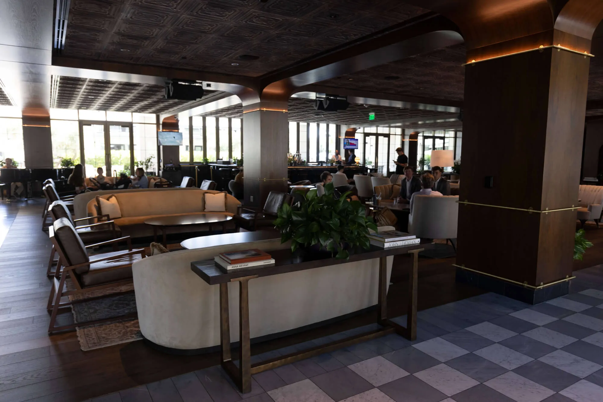
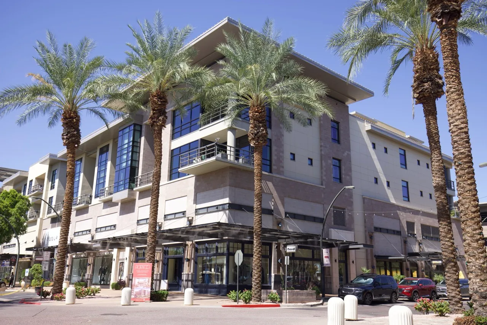
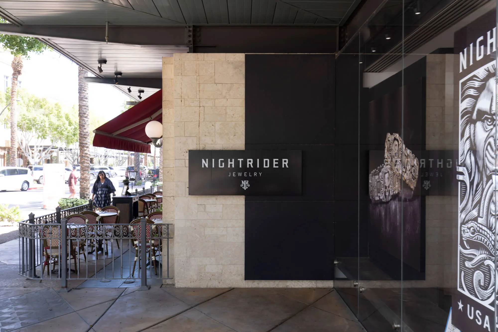
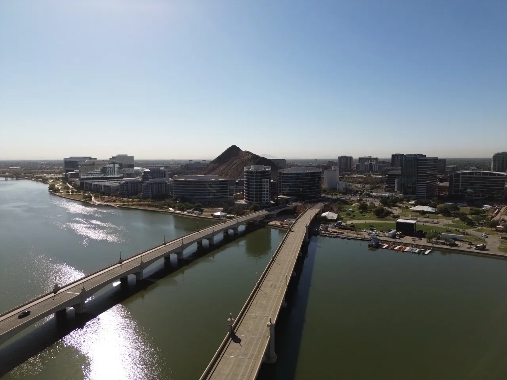
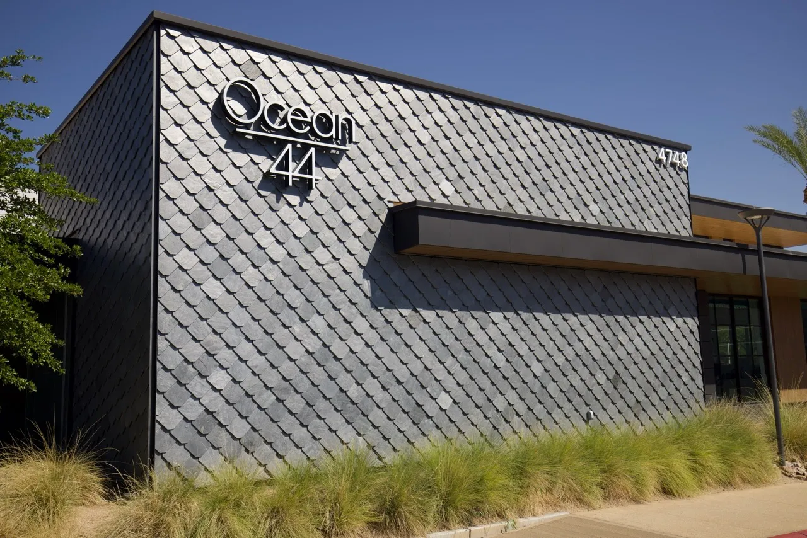
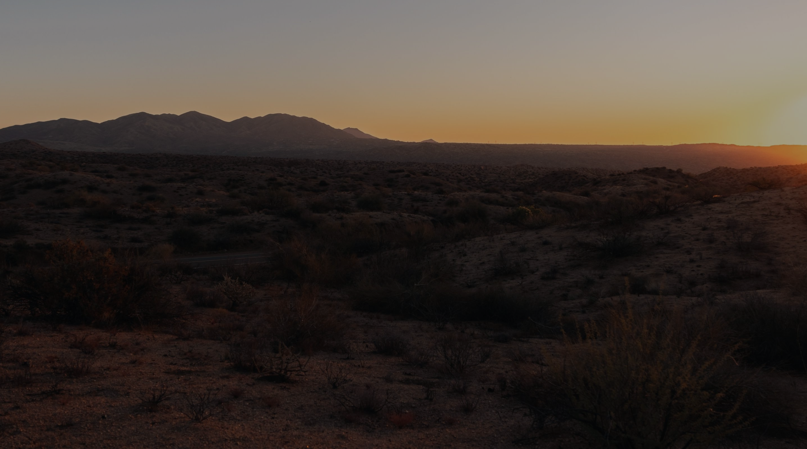

# Core Web Vitals & Performance Audit Report

**Site:** https://vidl-companies.pages.dev/
**Date:** 2026-03-22
**Methodology:** Static source analysis of local files (index.html, about.html, developments.html, site.js, CSS)
**Hosting:** Cloudflare Pages (edge CDN with automatic compression and HTTP/2+)

---

## Executive Summary

The site is a Webflow-exported static site hosted on Cloudflare Pages. While the hosting platform provides strong infrastructure (edge CDN, Brotli/gzip, HTTP/2), the source code contains several performance issues that will degrade Core Web Vitals, particularly LCP and CLS. The homepage is the heaviest page due to a hero background video, a full-screen loading spinner, numerous eagerly-loaded images, and a massive Google Fonts request.

**Estimated Core Web Vitals Assessment:**

| Metric | Estimated Status | Risk Level |
|--------|-----------------|------------|
| LCP    | POOR (>4.0s likely) | HIGH |
| INP    | GOOD (<=200ms likely) | LOW |
| CLS    | NEEDS IMPROVEMENT (0.1-0.25 likely) | MEDIUM |

---

## 1. Render-Blocking Resources (LCP Impact: HIGH)

### 1a. Three Render-Blocking CSS Files

All three pages load these CSS files synchronously in `<head>` with no `media` or async strategy:

```html
<link href="css/normalize.css" rel="stylesheet" type="text/css">
<link href="css/webflow.css" rel="stylesheet" type="text/css">
<link href="css/vidl-website.webflow.css" rel="stylesheet" type="text/css">
```

**Impact:** The browser cannot render anything until all three stylesheets download, parse, and apply. This directly delays LCP.

**Recommendation (HIGH priority):**
- Inline critical CSS (above-the-fold styles) directly in `<head>` with a `<style>` tag.
- Load the remaining CSS asynchronously using `<link rel="preload" as="style" onload="this.rel='stylesheet'">` or `media="print" onload="this.media='all'"`.
- Combine `normalize.css` and `webflow.css` into a single file to reduce HTTP round trips.

### 1b. Google Fonts -- Excessive Weight Request

All pages load an extremely bloated Google Fonts request:

```
fonts.googleapis.com/css2?family=Montserrat:ital,wght@0,100;0,200;0,300;0,400;0,500;0,600;0,700;0,800;0,900;1,100;1,200;1,300;1,400;1,500;1,600;1,700;1,800;1,900&family=Inter+Tight:wght@300;400;500;600;700&display=swap
```

This requests **all 18 weight/style combinations** of Montserrat (including italics) plus 5 weights of Inter Tight. The site visibly uses only 3-4 weights of each.

**Impact:** The font CSS file is render-blocking. The resulting font files add significant download weight. Even with `display=swap`, the sheer volume of font data increases load time.

**Recommendation (HIGH priority):**
- Reduce Montserrat to only the weights actually used (likely 400, 500, 600, 700) and remove italic if not used.
- Optimized request: `Montserrat:wght@400;500;600;700&family=Inter+Tight:wght@300;400;500;600;700&display=swap`
- Self-host fonts as WOFF2 for better caching and to eliminate the two DNS lookups to `fonts.googleapis.com` and `fonts.gstatic.com`.
- Add `font-display: swap` in @font-face rules if self-hosting.

### 1c. Lenis Smooth Scroll Library (Third-Party CDN)

```html
<script src="https://cdn.jsdelivr.net/gh/studio-freight/lenis@1.0.23/bundled/lenis.min.js"></script>
```

This is loaded synchronously at the end of `<body>`, which is good. However, it is fetched from a third-party CDN, adding a DNS lookup + TLS handshake to `cdn.jsdelivr.net`.

**Recommendation (MEDIUM priority):**
- Self-host the Lenis library to eliminate the third-party origin connection.
- Add `defer` attribute if not already implicit from placement.

---

## 2. LCP Candidates & Issues (HIGH Impact)

### 2a. Homepage -- Hero Background Video

The likely LCP element on the homepage is the hero section, which contains:

```html
<video autoplay loop muted playsinline data-object-fit="cover"
  style="background-image:url('videos/vidl-home-poster-00001.jpg')">
  <source src="videos/vidl-home-transcode.mp4">
  <source src="videos/vidl-home-transcode.webm">
</video>
```

**Issues:**
- The poster image is set via inline `background-image` CSS rather than the `poster` attribute, meaning the browser cannot discover it early.
- Neither the poster nor the video sources are preloaded.
- The hero logo image (`VIDLCOMPANY.webp`, up to 4109px wide) uses `loading="lazy"`, which is **wrong** for above-the-fold LCP content -- it delays loading.

```html

```

**Recommendation (CRITICAL):**
- Use the `poster` attribute on the `<video>` element instead of `background-image`.
- Add `<link rel="preload" as="image" href="videos/vidl-home-poster-00001.jpg">` in `<head>`.
- Change `loading="lazy"` to `loading="eager"` on the hero logo image.
- Add `fetchpriority="high"` to the LCP image.
- Consider preloading the video poster or primary hero image.

### 2b. Homepage -- Loading Spinner Blocks LCP

The homepage has a full-screen loader overlay:

```html
<div style="opacity:1;display:flex" class="loader">
  ...
  
  <div class="loading-circle"></div>
</div>
```

The loader stays visible for **at minimum 1800ms** after `window.load` fires (hardcoded in `site.js`):

```javascript
window.addEventListener("load", function () {
  setTimeout(function () {
    loader.style.transition = "opacity 0.5s ease";
    loader.style.opacity = "0";
    setTimeout(function () { loader.style.display = "none"; }, 500);
  }, 1800);
});
```

**Impact:** This adds ~2.3 seconds (1800ms wait + 500ms fade) **after** the page has fully loaded before the user sees real content. The LCP element (hero) is visually obscured during this entire time, pushing LCP well above the 4.0s "poor" threshold for many users.

**Recommendation (CRITICAL):**
- Remove or drastically shorten the loader delay (reduce 1800ms to 200-300ms maximum).
- Better yet, remove the loader entirely and let the content appear naturally.
- If a loader must exist, ensure it does not cover the LCP element, or animate it in a way that lets the hero content be painted by the browser (CSS `content-visibility`).

### 2c. Service Card Images -- Eager But Not Preloaded

Five service card images are loaded with `loading="eager"`:

```html





```

These are below the fold but loaded eagerly, competing with the hero for bandwidth.

**Recommendation (HIGH priority):**
- Change these to `loading="lazy"` since they are below the fold.
- Only the first viewport-visible image should be `loading="eager"`.

### 2d. Developments Page -- Hero Image (PNG, Up to 3024px)

```html

```

**Issues:**
- PNG format for a photographic hero image is very heavy. Should be WebP or AVIF.
- The `srcset` uses PNG variants for all sizes (500, 800, 1080, 1600, 2000, 2600, 3024) -- all PNG.
- No `fetchpriority="high"`.

**Recommendation (HIGH priority):**
- Convert hero images to WebP (already done for some other images, inconsistent across the site).
- Add `fetchpriority="high"` to the developments hero image.
- Add `<link rel="preload">` for the hero image.

### 2e. About Page -- No Above-the-Fold Image

The about page has no large hero image above the fold; the primary image uses `loading="lazy"`:

```html

```

The LCP element is likely the text block. This is acceptable, but the text LCP depends on the font loading (see section 1b).

---

## 3. CLS (Cumulative Layout Shift) Risks (MEDIUM Impact)

### 3a. Images Without Explicit Width/Height

**Every image across all three pages** lacks explicit `width` and `height` HTML attributes. Examples:

```html


```

**Impact:** Without `width`/`height` or CSS `aspect-ratio`, the browser cannot reserve space for images before they load. When images load, they push content down, causing layout shifts.

**Recommendation (HIGH priority):**
- Add `width` and `height` attributes to every `` tag that corresponds to the intrinsic dimensions (or aspect ratio) of the image.
- Alternatively, use CSS `aspect-ratio` on image containers.

### 3b. Font Swap (FOUT)

Google Fonts is loaded with `display=swap`, which is correct for performance but causes a flash of unstyled text (FOUT). The text renders in the fallback font, then re-renders when Montserrat/Inter Tight load, causing a layout shift if metrics differ significantly.

**Recommendation (MEDIUM priority):**
- Use `font-display: optional` instead of `swap` for non-critical fonts (reduces CLS but may show system font).
- Or use CSS `size-adjust` / `ascent-override` / `descent-override` on the fallback `@font-face` to match the web font metrics and eliminate the shift.

### 3c. Loading Spinner Overlay

The full-screen loader (homepage only) has `display:flex` initially. When it fades out and gets `display:none`, this could cause a reflow. However, since it is `position:fixed`, the impact on CLS should be minimal.

### 3d. Dynamic Transform Styles

Many elements have inline `opacity:0` and `transform` styles that are later animated in via JavaScript:

```html
<div style="...opacity:0" class="animation-left-0-2">
```

These are animated via IntersectionObserver and should not cause CLS since they use `transform` and `opacity` (compositor-only properties). **LOW risk.**

---

## 4. INP (Interaction to Next Paint) Risks (LOW Impact)

### 4a. Custom Cursor -- Mousemove Listener on Document

```javascript
document.addEventListener("mousemove", function (e) {
  circle.style.transform = "translate(" + e.clientX + "px, " + e.clientY + "px)";
});
```

**Impact:** This fires on every mouse movement and writes to the DOM. However, it only modifies `transform` on a `position:fixed` element with `will-change: transform`, so it should be handled by the compositor. The `will-change` declaration is present in CSS. **LOW risk**, but the listener itself adds overhead.

**Recommendation (LOW priority):**
- Use `requestAnimationFrame` to batch cursor position updates instead of updating on every mousemove event.

### 4b. Scroll Event Listeners

Two scroll listeners are registered:
1. Progress bar width update
2. Transparent nav scroll detection (uses `{ passive: true }` -- good)

The progress bar listener does NOT use `{ passive: true }`.

**Recommendation (LOW priority):**
- Add `{ passive: true }` to the progress bar scroll listener.

### 4c. Overall JavaScript Assessment

The site uses vanilla JavaScript (no jQuery, no heavy frameworks). The `site.js` file is well-structured with:
- IntersectionObserver for scroll animations (efficient)
- No blocking synchronous operations
- No heavy computations in event handlers
- Lenis smooth scroll is the heaviest library but is well-optimized

**INP verdict: GOOD.** The JavaScript is lightweight and well-structured.

---

## 5. Resource Optimization

### 5a. Image Format Inconsistency

The site mixes formats inconsistently:

| Format | Usage | Assessment |
|--------|-------|-----------|
| WebP | Most photo images (`.webp`) | Good |
| PNG | Hero images, logos, some photos | Bad -- should be WebP/AVIF for photos |
| AVIF | 1 logo (`Ganem-Est-1982-1_Logo.avif`) | Good but inconsistent |
| SVG | Icons, some logos | Good |

**Specific PNG offenders (should be WebP):**
- `images/Untitled-design-12-1.png` (developments hero, up to 3024px wide)
- `images/047A6100-1.png` (developments detail image)
- `images/Vidl-Dev.png` / `images/Urbnphx.png` (developments logos)
- `images/Untitled-design-38.png` (nav logo -- loaded on every page)
- `images/Untitled-design-34.png`, `images/Untitled-design-35.png`, `images/Untitled-design-36.png` (client logos)
- Multiple brand logos (`The-Workshop-Pilates_Logo.png`, `WePellet_Logo.png`, `UncleBears_Logo.png`, `StarkFuture_Logo.png`, `MonroesChicken_Logo.png`, `lowkey_Logo.png`, `HashKitchen_Logo.png`, `Lumberjaxes_Logo.png`)

**Recommendation (HIGH priority):**
- Convert all PNG photographs to WebP (50-70% smaller).
- Convert PNG logos to WebP or SVG where possible.
- Consider AVIF for hero images (even smaller than WebP for photographic content).

### 5b. Oversized Images

- `VIDLCOMPANY.webp` serves up to **4109px wide**. No viewport needs this. Max useful size for 2x retina on a 1920px screen is ~3840px, and the srcset should top out around 2000px for this logo.
- `HashKitchen_Logo.png` has a srcset up to **2560px** for a small logo in a grid.
- `Icryo_Logo.webp` up to **1920px** for a client logo thumbnail.

**Recommendation (MEDIUM priority):**
- Resize the maximum image to 2x the largest display size.
- For logos in a grid, cap at 600-800px max.

### 5c. Srcset Anomalies

Some srcsets serve the same file for multiple sizes:

```html
srcset="images/IMG_3658-Large_1IMG_3658-Large.webp 500w,
       images/IMG_3658-Large_1IMG_3658-Large.webp 800w,
       images/IMG_3658-Large_1IMG_3658-Large.webp 1080w,
       images/IMG_3658-Large_1.webp 1280w"
```

The same file is declared for 500w, 800w, and 1080w breakpoints, meaning no actual responsive sizing benefit.

**Recommendation (MEDIUM priority):**
- Generate actual resized variants for each breakpoint in the srcset.

### 5d. CSS and JS Minification

- `normalize.css` -- standard library, not minified in source but likely served compressed by Cloudflare.
- `webflow.css` -- appears to contain base64-encoded font data inline (webflow-icons). This adds weight.
- `site.js` -- not minified, but reasonably compact (~500 lines).

**Recommendation (LOW priority):**
- Minify all CSS and JS files for production deployment.
- Cloudflare Pages may auto-minify, but source-level minification is still recommended.

---

## 6. Third-Party Script Impact

### External Origins Contacted

| Origin | Resource | Impact |
|--------|----------|--------|
| `fonts.googleapis.com` | Google Fonts CSS | Render-blocking, DNS + TLS |
| `fonts.gstatic.com` | Font files (WOFF2) | Font loading delay |
| `cdn.jsdelivr.net` | Lenis smooth scroll (~15KB) | DNS + TLS, parser-blocking if sync |

**Total third-party origins: 3**

**Recommendation (MEDIUM priority):**
- Self-host both fonts and Lenis to reduce to **0 third-party origins**.
- This eliminates 3 DNS lookups and 3 TLS handshakes on first visit.

---

## 7. Font Loading Strategy

### Current Strategy

```html
<link href="https://fonts.googleapis.com" rel="preconnect">
<link href="https://fonts.gstatic.com" rel="preconnect" crossorigin="anonymous">
<link href="https://fonts.googleapis.com/css2?family=Montserrat:ital,wght@...&display=swap" rel="stylesheet">
```

**What is good:**
- `preconnect` hints for both Google Fonts origins are present.
- `display=swap` ensures text is visible immediately with fallback fonts.
- `crossorigin="anonymous"` is correctly set on the gstatic preconnect.

**What is bad:**
- The font CSS `<link>` is render-blocking (no `media` or preload strategy).
- All 18 Montserrat weight/style combinations are requested (massive overhead).
- Identical font request is duplicated across all 3 pages (no caching benefit on first load for each page, though HTTP cache helps after first page).

**Recommendation (HIGH priority):**
1. Reduce to only used weights: `Montserrat:wght@400;500;600;700` and `Inter Tight:wght@300;400;500;600;700`.
2. Self-host fonts as WOFF2 with proper `@font-face` declarations.
3. Use `font-display: swap` in self-hosted @font-face rules.
4. Preload the primary font file: `<link rel="preload" as="font" type="font/woff2" href="/fonts/montserrat-600.woff2" crossorigin>`.

---

## 8. Cloudflare Pages Hosting Assessment

Cloudflare Pages provides:
- Automatic Brotli/gzip compression for text assets (HTML, CSS, JS)
- Global edge CDN with short TTFB
- HTTP/2 (likely HTTP/3/QUIC)
- Automatic `cache-control` headers for static assets
- Free SSL/TLS

**What Cloudflare Pages does NOT provide automatically:**
- Image optimization/resizing (requires Cloudflare Images, a paid add-on)
- HTML minification (optional setting in Cloudflare dashboard)
- Automatic WebP/AVIF conversion

**Note:** Without Bash access, I was unable to verify actual HTTP response headers (cache-control, content-encoding). Based on Cloudflare Pages defaults, static assets receive long-lived cache headers and Brotli compression.

---

## 9. Prioritized Recommendations Summary

### Critical (Immediate -- Expected to Improve LCP by 2-4+ seconds)

| # | Action | Metric | Expected Impact |
|---|--------|--------|----------------|
| 1 | Remove or reduce loader delay from 1800ms to <=200ms | LCP | -2.0s LCP |
| 2 | Change hero logo from `loading="lazy"` to `loading="eager"` and add `fetchpriority="high"` | LCP | -0.5-1.0s LCP |
| 3 | Use proper `poster` attribute on hero video instead of CSS `background-image` | LCP | -0.3-0.5s LCP |
| 4 | Preload the hero image/video poster in `<head>` | LCP | -0.3-0.5s LCP |

### High Priority (Expected to improve LCP/CLS noticeably)

| # | Action | Metric | Expected Impact |
|---|--------|--------|----------------|
| 5 | Reduce Google Fonts to only used weights (4 Montserrat + 5 Inter Tight) | LCP | -0.3-0.5s LCP |
| 6 | Add `width` and `height` attributes to all `` tags | CLS | -0.05-0.15 CLS |
| 7 | Convert all PNG photos/hero images to WebP or AVIF | LCP | -0.5-1.5s LCP |
| 8 | Change below-fold service card images from `loading="eager"` to `loading="lazy"` | LCP | -0.2-0.5s LCP (bandwidth saved) |
| 9 | Inline critical CSS and async-load remaining stylesheets | LCP | -0.3-0.5s LCP |

### Medium Priority

| # | Action | Metric | Expected Impact |
|---|--------|--------|----------------|
| 10 | Self-host Google Fonts and Lenis (eliminate 3 third-party origins) | LCP | -0.1-0.3s LCP |
| 11 | Generate proper responsive image variants for srcsets | LCP | Bandwidth savings |
| 12 | Cap maximum image dimensions (logos at 800px, hero at 2x display) | LCP | Bandwidth savings |
| 13 | Add `size-adjust` fallback font metrics to reduce FOUT shift | CLS | -0.02-0.05 CLS |

### Low Priority

| # | Action | Metric | Expected Impact |
|---|--------|--------|----------------|
| 14 | Use `requestAnimationFrame` for cursor mousemove updates | INP | Marginal |
| 15 | Add `{ passive: true }` to progress bar scroll listener | INP | Marginal |
| 16 | Minify CSS and JS at source level | All | Minor bandwidth savings |
| 17 | Combine normalize.css + webflow.css into single file | LCP | -1 HTTP request |

---

## 10. Page-by-Page Summary

### Homepage (index.html)
- **LCP element:** Hero video poster / hero logo image
- **Biggest issues:** Loading spinner adds 2.3s delay; hero logo uses `loading="lazy"`; video poster not preloaded; 5 eager below-fold images compete for bandwidth; massive Google Fonts request
- **Estimated LCP:** 5-8 seconds (POOR)
- **Estimated CLS:** 0.1-0.2 (NEEDS IMPROVEMENT) due to missing image dimensions and font swap
- **Estimated INP:** <100ms (GOOD)

### About Page (about.html)
- **LCP element:** Large text block ("We believe in the power of exceptional design...")
- **Biggest issues:** Font loading delay affects text LCP; images lack dimensions; same font overhead
- **Estimated LCP:** 2.5-4.0s (NEEDS IMPROVEMENT)
- **Estimated CLS:** 0.1-0.15 (NEEDS IMPROVEMENT)
- **Estimated INP:** <100ms (GOOD)

### Developments Page (developments.html)
- **LCP element:** Hero image (PNG, up to 3024px wide)
- **Biggest issues:** Hero image is PNG not WebP; no `fetchpriority="high"`; no preload; PNG hero images in srcset with no actual size variants; images lack dimensions
- **Estimated LCP:** 3.0-5.0s (NEEDS IMPROVEMENT to POOR)
- **Estimated CLS:** 0.1-0.15 (NEEDS IMPROVEMENT)
- **Estimated INP:** <100ms (GOOD)

---

*Note: All LCP/CLS/INP estimates are based on static source analysis. For actual field data, check CrUX Vis (https://cruxvis.withgoogle.com) once the site has sufficient traffic, or run Lighthouse 13.0 lab tests for diagnostic measurements. Lab tests should be validated against CrUX field data for real-world performance at the 75th percentile.*
